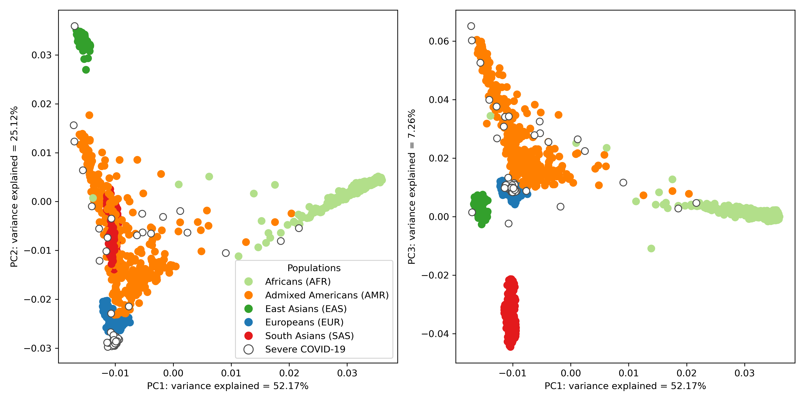

# Low-coverage whole genome sequencing for a highly selective cohort of severe COVID-19 patients

[](https://www.linux.org/) [](https://prettier.io/) [](https://www.python.org/) [](https://black.readthedocs.io/en/stable/) [](LICENSE.md)

This repository contains the scripts used in Santos et al. **Low-coverage whole genome sequencing for a highly selective cohort of severe COVID-19 patients**. Supporting data, including validation files and patient clinical histories, are archived in our [Figshare collection](https://doi.org/10.25452/figshare.plus.c.6347534). Genetic data for the patient cohort can be found in our European Genome-phenome Archive study [EGAS00001007573](https://ega-archive.org/studies/EGAS00001007573). This repository will remain open for support with reproducibility and issues.

# Abstract

### Background

Despite advances in identification of genetic markers associated to severe COVID symptoms, the full genetic characterisation of the disease remains elusive. Imputation of low-coverage whole genome sequencing has emerged as a competitive method to study such disease-related genetic markers as they enable genotyping of most common genetic variants used for genome wide association studies. This study aims at exploring the potential use of imputation in low-coverage whole genome sequencing for a highly selected severe COVID-19 patient cohort.

### Findings

We generated an imputed dataset of 79 variant call format (VCF) patient files using the GLIMPSE1 tool, each containing, on average, 9.5 million single nucleotide variants. The validation assessment of imputation accuracy yielded a squared Pearson correlation of approximately 0.97 across sequencing platforms, showing that GLIMPSE1 can be used to confidently impute variants with minor allele frequency up to approximately 2% in Spanish ancestry individuals. We conducted a comprehensive analysis on the patient cohort, examining hospitalisation and intensive care utilisation, sex and age-based differences, and clinical phenotypes using a standardised set of medical terms specifically developed to characterise severe COVID-19 symptoms for this cohort.

### Conclusion

This dataset highlights the utility and accuracy of low-coverage whole genome sequencing imputation in the study of COVID-19 severity, setting a precedent for other applications in resource-constrained environments linked to comprehensive analyses of genetic components for various complex diseases. The methods and findings presented here may be leveraged in future genomic projects, providing vital insights for health challenges like COVID-19.


_Projection of imputed low-coverage whole-genome sequencing (lcWGS) data from severe COVID-19 patients against the backdrop of global superpopulations from the 1000 Genomes Project. Each point represents an individual, colour-coded according to their superpopulation. Severe COVID-19 patients are distinguished by points with a white fill and coloured border. The x-axis and y-axis on the two subplots represent the first and second, and first and third principal components, respectively, with the percentage of variance explained by each component indicated in the axis label._

# Software implementation

All the source code used to generate the results and figures in the paper are in the [`scripts`](scripts) folder. See the `README.md` files in each directory for a full description.

# Setup

## Getting the code

You can download a copy of all the files in this repository by cloning this git repository.

```
git clone https://github.com/renatosantos98/GLIMPSE-low-coverage-WGS-imputation.git
```

A copy of the repository is also archived at [doi.org/10.25452/figshare.plus.21679799](https://doi.org/10.25452/figshare.plus.21679799).

## Dependencies

You'll need a working Python environment to run the code. We recommend you set up your environment through [Anaconda](https://www.anaconda.com/download/), which provides the `conda` package manager.

Run the following command in the main repository folder (where [`environment.yml`](environment.yml) is located) to create a conda environment and install all required dependencies in it.

```bash
conda env create -f environment.yml
conda activate glimpse
```

## Running the code

All scripts were designed to be run from the main repository folder. To reproduce the data generated in the paper, run the scripts in the following order and syntax:

```bash
bash scripts/1_setup.sh
bash scripts/2_gl_calling.sh
bash scripts/3_glimpse_impute_parallel.sh
bash scripts/4_vcf_filtering.sh
bash scripts/5_glimpse_concordance.sh
bash scripts/6_pca.sh
```

See the `README.md` files in the [`scripts`](scripts) directory for a full description of each script and required files.

# License

All source code is made available under an MIT license. You can freely use and modify the code, without warranty. See [`LICENSE.md`](LICENSE.md) for the full license text. The authors reserve the rights to the
article content, which is currently submitted for publication.
