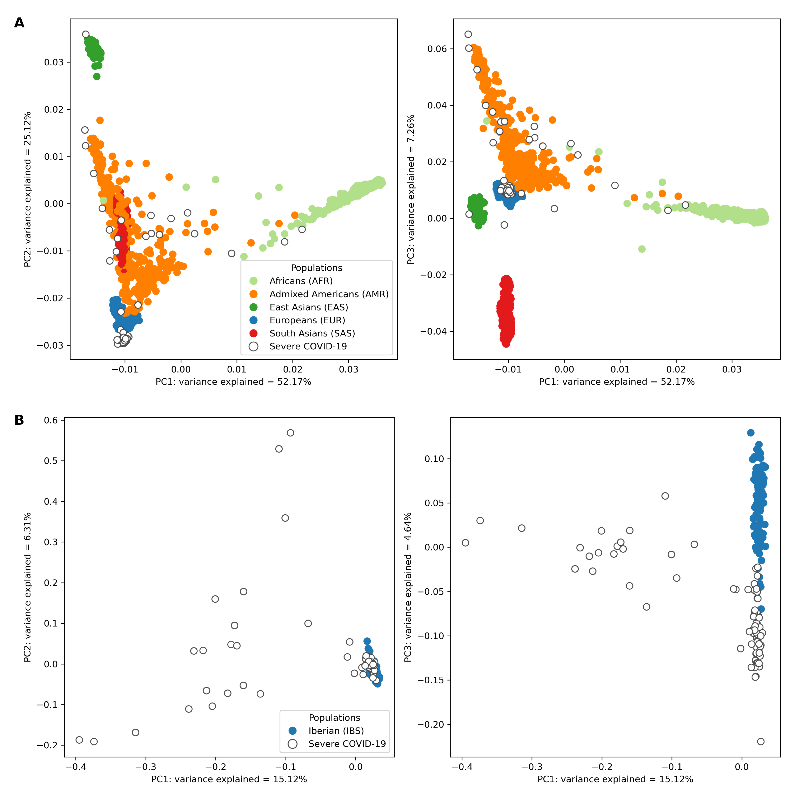

# PCA
This directory contains information on the principal component analysis (PCA) performed on the quality-filtered VCF files.

The directories [`1000G_pca`](pca\1000G_pca) and [`IBS_pca`](pca\IBS_pca) contain the eigenvalues and eigenvectors for the global and IBS 1000 Genomes datasets, respectively, which were used to generate the [`combined_plot`](combined_plot.png) figure, corresponding to **Figure 3**.

## Figure 3

**Principal component analysis of genetic variation in the severe COVID-19 patient cohort against the 1000 Genomes Project global superpopulations and IBS (Iberian Populations in Spain) population.**

**A** Projection of imputed low-coverage whole-genome sequencing (lcWGS) data from severe COVID-19 patients against the backdrop of global superpopulations from the 1000 Genomes Project. Each point represents an individual, colour-coded according to their superpopulation. Severe COVID-19 patients are distinguished by points with a white fill and coloured border. The x-axis and y-axis on the two subplots represent the first and second, and first and third principal components, respectively, with the percentage of variance explained by each component indicated in the axis label.

**B** Focused view of the genetic variation within the Iberian (IBS) population and the severe COVID-19 patients. Individuals from the IBS population are represented by solid-coloured points, while those with severe COVID-19 are represented by points with a white fill and coloured border. The x-axis and y-axis on the two subplots represent the first and second, and first and third principal components, respectively, with the percentage of variance explained by each component indicated in the axis label.
