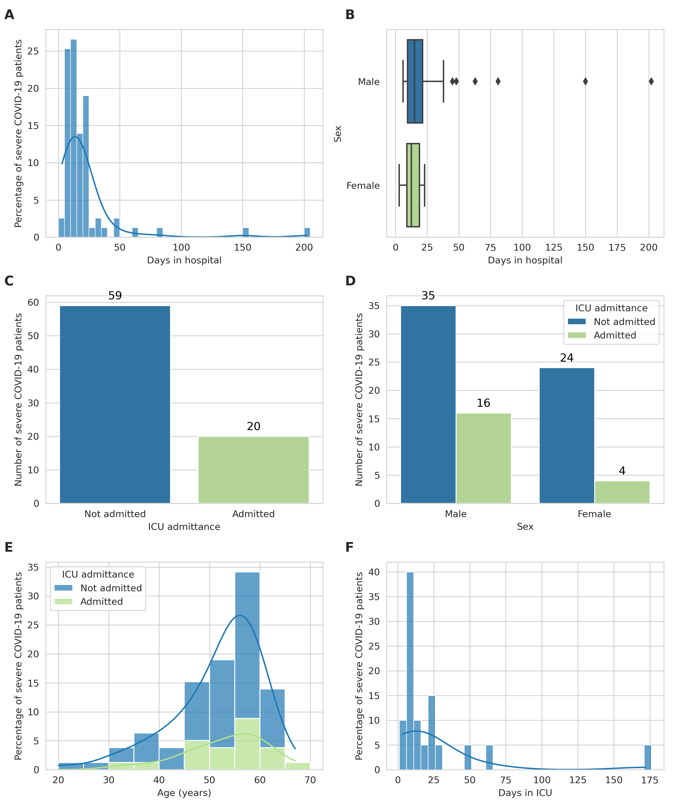
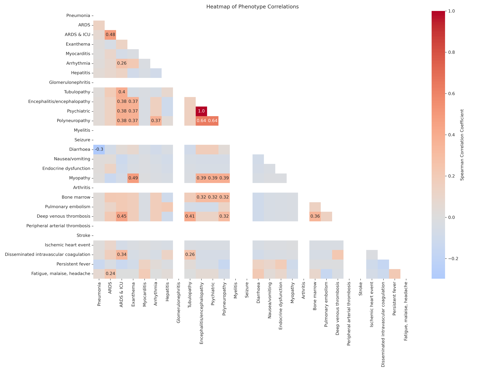

# Phenostats
This directory contains information on the phenotypes of the severe COVID-19 patient cohort, in the [`phenostats`](phenostats.csv) file, and the insights derived from them.

This data was used to generate the figures [`plot_1`](plot_1.png), [`plot_2`](plot_2.png), and [`plot_3`](plot_3.png), corresponding to **Figure 2**, **Figure 4**, and **Figure 5**.

## Figure 2

**Figure 2 – Demographic and geographic characterisation of the severe COVID-19 patient cohort.**

**A** Distribution of severe COVID-19 patients' ages in our cohort. Each bar signifies an age bracket comprising 5-year increments, with its height denoting the proportion of individuals within that age range. The plot is overlaid with a Kernel Density Estimation (KDE) curve, which provides a smoothed estimation of the age distribution.

**B** Patients’ stratification by sex. Each bar represents one sex, with its length indicating the number of patients of that sex.

**C** Distribution of patients' ages by sex. The boxplot presents the age distribution for each sex. Each box represents the interquartile range (IQR) of ages for either males or females, with the dividing line representing the median age. The diamonds represent outliers.

**D** Distribution of patients by country of origin. Each bar corresponds to a country, and its length indicates the number of patients from that country.

## Figure 4

**Figure 4 – Analysis of hospital stays among the severe COVID-19 patient cohort.**

**A** Distribution of hospital stay durations in our cohort. Each bar corresponds to an interval of hospital stay durations of 5 days, with its height indicating the proportion of patients with a stay duration within that duration interval. The plot is overlaid with a Kernel Density Estimation (KDE) curve, that provides a smoothed estimate of the duration distribution.

**B** Stratification of hospital stay durations by sex. This boxplot presents the distribution of hospital stays for each sex. Each box represents the interquartile range (IQR) of the duration of hospital stays for one sex, with the line inside the box marking the median duration. The diamonds represent outliers.

**C** Distribution of patients admitted to the Intensive Care Unit (ICU). Each bar corresponds to either patients admitted to the ICU (green) or patients not admitted to the ICU (blue), with its height indicating the number of patients in that category.

**D** Distribution of patients admitted to the ICU by sex. Each pair of bars corresponds to one sex, with their height indicating the proportion of patients of that sex who were admitted to the ICU. Each bar corresponds to either patients admitted to the ICU (green) or patients not admitted to the ICU (blue), with its height indicating the number of patients in that category.

**E** Distribution of ages of patients admitted to the ICU. Each bar corresponds to an age group of 5 years, with its height indicating the proportion of patients in that age group. The plot is overlaid with a KDE curve, which provides a smoothed estimate of the age distribution.

**F** Distribution of ICU stay durations among patients admitted to the ICU. Each bar corresponds to an interval of ICU stay durations of 5 days, with its height indicating the number of patients within that duration interval. The plot is overlaid with a KDE curve, that provides a smoothed estimate of the duration distribution. Only patients who were admitted to the ICU are represented in this plot.

## Figure 5

**Figure 5 – Heatmap of phenotype correlations in the severe COVID-19 patient cohort.**

The plot illustrates the Spearman correlations between our 28 severe COVID-19 specific phenotypes. Each square in the heatmap represents the correlation between two phenotypes, with the colour of the square indicating the strength of the correlation, and the number inside each square represents the correlation coefficient. Only statistically significant (p < 0.05) correlation coefficients are shown. Darker colours represent stronger positive or negative correlations, with red representing positive correlations and blue representing negative correlations. These indicate that individuals displaying one phenotype are more or less likely to exhibit the other phenotype as well, suggesting potential underlying mechanisms for the progression of severe COVID-19.
