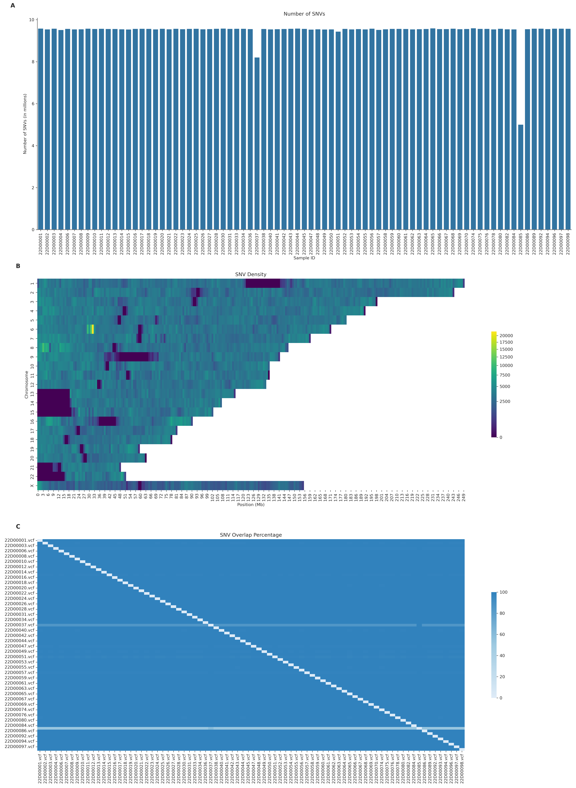

# VCF_Stats
This directory contains information on the VCF files after quality filtering.

The file [`snps.txt`](snps.txt), and overlap and variant location matrices were used to generate the [`plot_4`](plot_4.png) figure, corresponding to **Figure 1**.

## Figure 1

**Figure 1 – Characterisation of the genomic landscape of the imputed VCF dataset.**

**A** Number of high-confidence single nucleotide variants (SNVs) for the 79 VCF files in the severe COVID-19 dataset. The x-axis represents the sample IDs in the dataset, while the y-axis denotes the total counts of SNVs for each sample in millions (1×106).

**B** SNV density across chromosomes in the dataset. The heatmap shows the distribution of SNVs along the chromosomes, with each row representing a chromosome, 1-22 and X, and each column a bin sized 1 megabase (Mb). The number of SNVs in each bin is weighted for the number of samples containing each variant, to represent an average sample in the dataset. Colours range from low (blue) to high (yellow) SNP density.

**C** Percentage of overlap of SNVs between samples. The heatmap visualises the extent of shared SNVs across different samples, with each cell representing the overlap percentage from the sample on the x-axis to the sample on the y-axis. Therefore, the percentage shown is the proportion of SNVs in the sample on the x-axis that are also found in the sample on the y-axis. The colour gradient from light to dark blue signifies increasing percentage of overlap.
